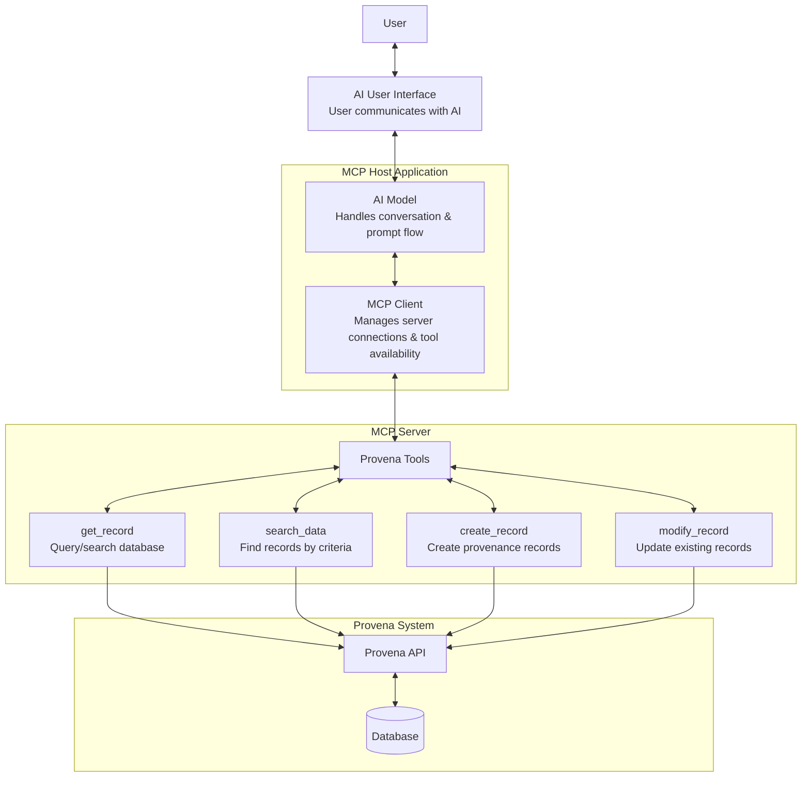
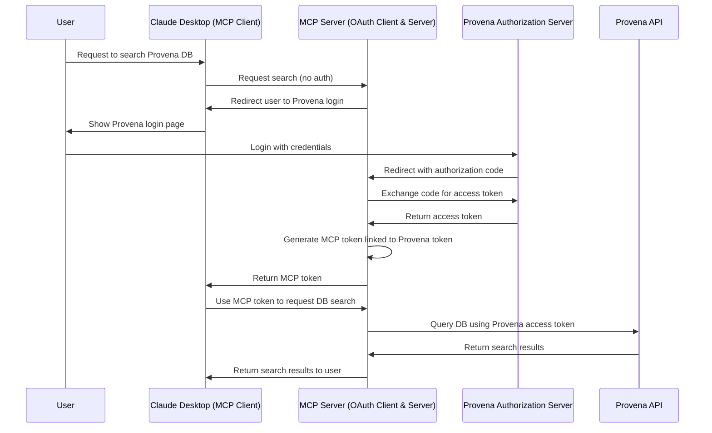

# Conversational Interface for Provena using MCP and LLMs

## Project Goal

Use Large Language Models (LLMs) and Model Context Protocols (MCPs) to allow users to interact with Provena in a more human, conversational way — reducing the need for traditional, time-consuming, and complex manual metadata entry.

## User Story

_As a researcher using Provena, I want to interact with the system through a natural language interface powered by LLMs and MCPs, so that I can create, manage, and enrich metadata without needing to manually enter complex information or navigate rigid forms._

## Proof of Concept

This project’s current proof of concept uses **Claude Desktop** as both the LLM client and host. The focus is on:

- Implementing the **MCP server** that exposes Provena tools (e.g., `get_record`, `create_record`, etc.)
- Handling **authentication and secure communication** with the Provena API
- Demonstrating that a conversational AI can successfully interact with Provena’s API for real metadata workflows

This POC validates the technical feasibility of using AI to reduce metadata management complexity in research systems like Provena.

## POC Development Checklist

- [ ] **Set up remote MCP server foundations**  
  Create basic structure for the server, tooling interfaces, and plugin registration.

- [ ] **Define basic tool definitions**  
  Implement 'mock' `get_record`, `search_data`, `create_record`, `modify_record` tools.

- [ ] **Verify Claude Desktop connects to remote MCP server**  
  Ensure Claude can list and interact with exposed tools remotely.

- [ ] **Implement authentication using third-party authorization flow**  
      Handle token acquisition and attach credentials to tool requests securely.
    - [ ] Confirm Provena supports OAuth 2.0 (Authorization Code Flow)
    - [ ] Register the MCP Server as an OAuth Client in Provena
    - [ ] Implement OAuth Authorization Code Flow in MCP Server
    - [ ] Generate MCP Access Tokens linked to Provena sessions
    - [ ] Handle token expiry and revocation
    - [ ] Secure OAuth credentials and token handling

- [ ] **Connect MCP server tools to real Provena API endpoints**  
      Begin with read operations, then expand to write/update.
    - [ ] Implement `get_record`
    - [ ] Implement `search_data`
    - [ ] Implement `create_record`
    - [ ] Implement `modify_record`
          
- [ ] **Validate full conversational flow**  
  User → Claude → MCP client → server tools → Provena API → useful response → back to user.

- [ ] **Evaluate UX: Is it actually simpler and more efficient?**  
  Compare time and steps to complete a task via:
  - Traditional Provena UI
  - Conversational AI + MCP tools

## Overview of Flow

## Possible Authentication/Authorisation Flow

