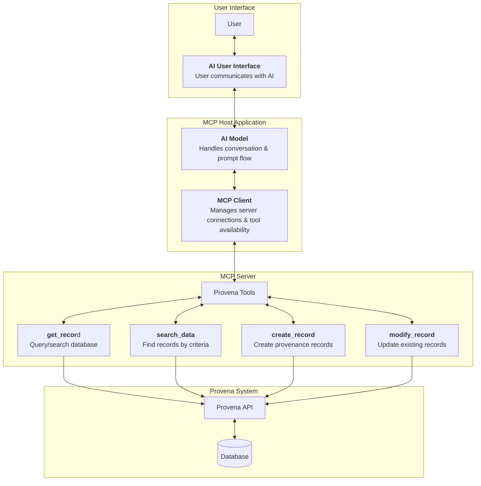

# Conversational Interface for Provena using MCP and LLMs

## Project Goal

Use Large Language Models (LLMs) and Model Context Protocols (MCPs) to allow users to interact with Provena in a more human, conversational way — reducing the need for traditional, time-consuming, and complex manual metadata entry.

## User Story

_As a researcher using Provena, I want to interact with the system through a natural language interface powered by LLMs and MCPs, so that I can create, manage, and enrich metadata without needing to manually enter complex information or navigate rigid forms._

## Proof of Concept

This project’s current proof of concept uses **Claude Desktop** as both the LLM client and host. The focus is on:

- Implementing the **MCP server** that exposes Provena tools (e.g., `get_record`, `create_record`, etc.)
- Handling **authentication and secure communication** with the Provena API
- Demonstrating that a conversational AI can successfully interact with Provena’s API for real metadata workflows

This POC validates the technical feasibility of using AI to reduce metadata management complexity in research systems like Provena.

## Features
- Secure authentication with Provena using device flow
- Tokens stored in your OS keyring (never in plain text files)
- No sensitive files committed to the repo
- Simple local dev setup

## Setup

1. **Clone the repo**
2. **Create a virtual environment:**
   ```sh
   python3 -m venv venv
   source venv/bin/activate
   ```
3. **Install dependencies:**
   ```sh
   pip install .
   ```
4. **Set environment variables**:
   - Set the .env.example to .env and put in your openai api key

## Usage

- Start the server:
  ```sh
  python provena_mcp_server.py --http
  ```
- Use the provided mcp client to interact with the server (must provide OpenAI API key in .env to use.
  ```sh
  python mcp_client.py
  ```
-  Test using the tools in the MCP Server via talking to the MCP Client
-  For example, use the login tool to which will open the browser and prompt user login to provide the server with the access token

## Security
- Tokens are stored in your OS keyring (see the `keyring` Python package docs for details).
- No `.tokens.json`, `.enc`, or `.key` files are committed or needed.
- On logout, any temp files created by the Provena client are deleted automatically.

## .gitignore
Sensitive and temp files are ignored by default (see `.gitignore`).

## POC Development Checklist

- [x] **Set up remote MCP server foundations**  
  Create basic structure for the server, tooling interfaces, and plugin registration.

- [ ] **Define basic tool definitions**  
  Implement 'mock' `get_record`, `search_data`, `create_record`, `modify_record` tools.

- [x] **Create Terminal based MCP Client chatbot**  

- [x] **Implement authentication using third-party authorization flow**  
      Handle token acquisition and attach credentials to tool requests securely.
    - [x] Confirm Provena supports OAuth 2.0 (Authorization Code Flow)
    - [x] Register the MCP Server as an OAuth Client in Provena
    - [x] Implement OAuth Authorization Code Flow in MCP Server

- [ ] **Connect MCP server tools to real Provena API endpoints**  
      Begin with read operations, then expand to write/update.
    - [ ] Implement `get_record`
    - [ ] Implement `search_data`
    - [ ] Implement `create_record`
    - [ ] Implement `modify_record`
          
- [ ] **Validate full conversational flow**  
  User → Claude → MCP client → server tools → Provena API → useful response → back to user.

- [ ] **Evaluate UX: Is it actually simpler and more efficient?**  
  Compare time and steps to complete a task via:
  - Traditional Provena UI
  - Conversational AI + MCP tools

## Overview of Flow

