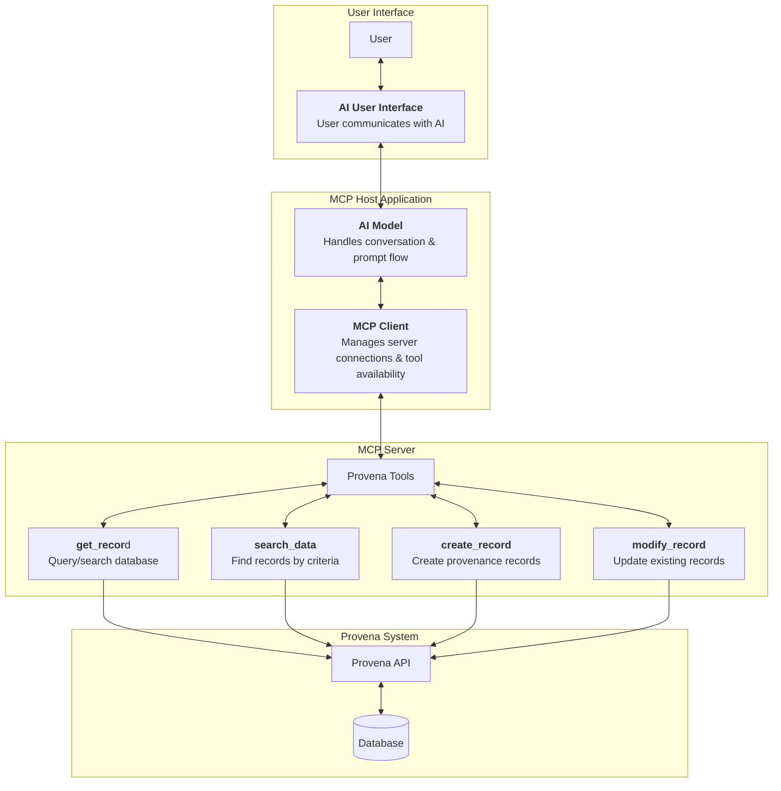

# Conversational Interface for Provena using MCP and LLMs

## Project Goal

Use Large Language Models (LLMs) and Model Context Protocols (MCPs) to allow users to interact with Provena in a more human, conversational way — reducing the need for traditional, time-consuming, and complex manual metadata entry.

## User Story

_As a researcher using Provena, I want to interact with the system through a natural language interface powered by LLMs and MCPs, so that I can create, manage, and enrich metadata without needing to manually enter complex information or navigate rigid forms._

## Proof of Concept

This project’s current proof of concept uses **Custom Terminal Based Chatbot** as both the LLM client and host. The focus is on:

- Implementing the **MCP server** that exposes Provena tools (e.g., `get_record`, `create_record`, etc.)
- Handling **authentication and secure communication** with the Provena API
- Demonstrating that a conversational AI can successfully interact with Provena’s API for real metadata workflows

This POC validates the technical feasibility of using AI to reduce metadata management complexity in research systems like Provena.

## Setup

1. **Clone the repo**
  ```sh
  git clone https://github.com/provena/mcp.git
  cd mcp
  ```
2. **Create a virtual environment:**
  ```sh
  python -m venv venv
  source venv/bin/activate
  ```
3. **Install dependencies:**
  ```sh
  pip install .
  pip install --upgrade cloudpathlib fastmcp
  ```
4. **Set environment variables:**
  - Copy `.env.example` to `.env` and fill in your OpenAI API key.
  - You can also set the OpenAI model in `.env` (see below).

## Usage

**Start the MCP server** (from the `mcp` folder):
```sh
python server/provena_mcp_server.py --http
```

**Start the MCP client** (from the `mcp` folder, in another terminal, ensuring you are in the mcp folder and venv is activated):
```sh
python client/mcp_client.py
```

**Debug mode:**
To show detailed info about tool calls and API responses (JSON dumps, etc.), run:
```sh
python client/mcp_client.py dev
```

**Model selection:**
Set the model in your `.env` file:
```
OPENAI_MODEL=gpt-4o-mini
```
If not set, defaults to `gpt-4o-mini`.

## .gitignore
Sensitive and temp files are ignored by default (see `.gitignore`).


## Overview of Flow

