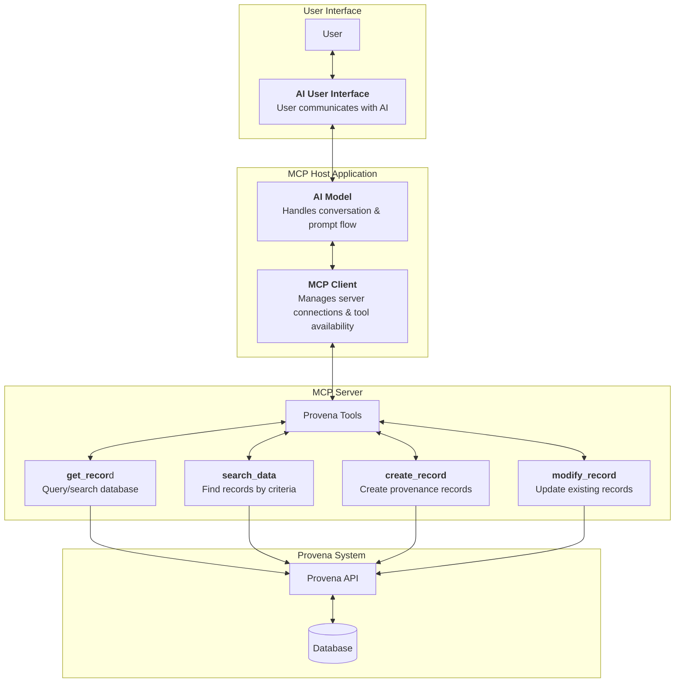

# Conversational Interface for Provena using MCP and LLMs

## Project Goal

Use Large Language Models (LLMs) and Model Context Protocols (MCPs) to allow users to interact with Provena in a more human, conversational way — reducing the need for traditional, time-consuming, and complex manual metadata entry.

## User Story

_As a researcher using Provena, I want to interact with the system through a natural language interface powered by LLMs and MCPs, so that I can create, manage, and enrich metadata without needing to manually enter complex information or navigate rigid forms._

## Proof of Concept

This project’s current proof of concept uses **Custom Terminal Based Chatbot** as both the LLM client and host. The focus is on:

- Implementing the **MCP server** that exposes Provena tools (e.g., `get_record`, `create_record`, etc.)
- Handling **authentication and secure communication** with the Provena API
- Demonstrating that a conversational AI can successfully interact with Provena’s API for real metadata workflows

This POC validates the technical feasibility of using AI to reduce metadata management complexity in research systems like Provena.

## Setup

1. **Clone the repo**
  ```sh
  git clone https://github.com/provena/mcp.git
  cd mcp
  ```
2. **Create a virtual environment:**
  ```sh
  python -m venv venv
  source venv/bin/activate
  ```
3. **Install dependencies:**
  ```sh
  pip install .
  pip install --upgrade cloudpathlib fastmcp
  ```
4. **Set environment variables:**
   - Copy `.env.example` to `.env` and fill in your values (OpenAI key, `PROVENA_CONFIG_FILE`, `PROVENA_INSTANCE`, etc.).
   - The **MCP server** loads `.env` from the repository root on startup. Variables already set in the shell or by your MCP host take precedence over `.env`.
   - You can also set the OpenAI model in `.env` (see below).

## Provena instances and offline tokens

The server resolves Keycloak domain, realm, service URLs, and optional **offline refresh tokens** the same way as the [RRAP cf-airflow MCP](https://github.com/gbrrestoration/rrap-cf-airflow/tree/mcp/mcp): JSON config plus environment.

- **Option A (recommended):** Point `PROVENA_CONFIG_FILE` at the committed `provena_instances.example.json` (paths are relative to the process working directory, usually the repo root). Copy `.env.example` to `.env` — it already sets this. Edit the JSON there if you need different domains or API URLs.
- **Option B:** Copy `provena_instances.example.json` to `provena_instances.json` and rely on the default config path (no `PROVENA_CONFIG_FILE` needed).
- With **more than one** instance in that file, set **`PROVENA_INSTANCE`** to the instance key (e.g. `dev.rrap-is.com` or `mds.gbrrestoration.org`).
- For headless or long-running use, obtain an offline token with the script (opens a browser once):

  ```sh
  python scripts/generate_provena_offline_token.py --instance <instance-key> --save
  ```

  That writes `provena_tokens.json` (gitignored). Alternatively set `PROVENA_OFFLINE_TOKEN` in the environment (do not commit it).

- When multiple instances exist in the instances JSON, set `PROVENA_INSTANCE` to the instance key you want.

Useful MCP tools: `list_provena_instances`, `get_provena_offline_token_instructions`, `get_provena_connection_info`, and `check_authentication_status` (reports `mode`: `offline`, `device`, `none`, or `offline_invalid`).

**Precedence:** If an offline token is configured for the selected instance, it is used instead of the interactive device flow. Use `logout_from_provena` to clear the in-memory session; remove the offline token from disk or unset `PROVENA_OFFLINE_TOKEN` to stop using offline auth.

## Usage

**Start the MCP server** (from the `mcp` folder, with repo root as cwd so `PROVENA_CONFIG_FILE=provena_instances.example.json` resolves):
```sh
python server/provena_mcp_server.py --http
```

HTTP bind address and port (optional; defaults `127.0.0.1:5000`, use `0.0.0.0` in Docker):

```sh
MCP_HTTP_HOST=0.0.0.0 MCP_HTTP_PORT=5000 python server/provena_mcp_server.py --http
```

### Cursor (local MCP)

This repo includes **`.cursor/mcp.json`**, which registers a **stdio** Provena MCP server for Cursor when this folder is the workspace root.

1. Install dependencies (`pip install .` or your venv) so `python` can import `fastmcp` and `provenaclient`.
2. Copy **`.env.example`** to **`.env`** and set at least `PROVENA_CONFIG_FILE`, `PROVENA_INSTANCE`, and any tokens you use. Cursor passes **`envFile`** so the server loads `.env` on startup.
3. If `python` on your PATH is not the venv interpreter, change **`command`** in `.cursor/mcp.json` to the full path to that Python (for example `${workspaceFolder}/.venv/Scripts/python.exe` on Windows or `${workspaceFolder}/.venv/bin/python` on macOS/Linux).
4. Reload MCP in Cursor (**Settings → MCP** or restart Cursor). Check **Output → MCP Logs** if the server fails to start.

Optional **Streamable HTTP** transport (MCP standard): run `python server/provena_mcp_server.py --http` in a terminal. With a recent **FastMCP** and **httpx ≥ 0.28.1**, the endpoint is `http://127.0.0.1:5000/mcp` by default (`MCP_HTTP_PATH` overrides the path). Add a second server in `mcp.json` with that `url` instead of stdio.

**Dependency note:** `provenaclient` on PyPI still declares `httpx<0.28`, while FastMCP versions that expose Streamable HTTP need `httpx>=0.28.1`, so a normal `pip install .` may resolve to an older FastMCP. In that case `--http` falls back to **legacy SSE** on `/sse` and prints a short message to stderr. The **Dockerfile** in this repo installs a compatible stack so the container uses Streamable HTTP on `/mcp`. When you are stuck on SSE locally, either align versions (newer `provenaclient` once it relaxes the httpx pin, or install `fastmcp` / `httpx` in a order similar to the Docker image) or point your client at `http://127.0.0.1:5000/sse` and set `PROVENA_MCP_HTTP_URL` for `client/mcp_client.py`.

### Remote MCP server

To connect to the MCP server remotely, configure your tool such as Cursor or Claude code with:
```
{
  "mcpServers": {
    "provena": {
      "type": "http",
      "url": "http://server:port/mcp"
    }
  }
}
```

For Claude, it's usually a .mcp.json file in the project folder.


### Docker

Build and run the same HTTP MCP server (listens on `0.0.0.0:5000` inside the container):

```sh
docker build -t provena-mcp .
docker run --rm -p 5000:5000 provena-mcp
```

Point your MCP client at the Streamable HTTP URL for that port (default path `/mcp` on the bound port). Override Provena settings with `-e`, for example `-e PROVENA_INSTANCE=mds.gbrrestoration.org`. For offline auth, pass a token or mount a tokens file (the image sets `PROVENA_MCP_NO_DOTENV=1` so a local `.env` is not read inside the container):

```sh
docker run --rm -p 5000:5000 \
  -e PROVENA_OFFLINE_TOKEN="your-refresh-token" \
  provena-mcp
```

Or mount a gitignored `provena_tokens.json` from the host and tell the runtime where it lives:

```sh
docker run --rm -p 5000:5000 \
  -v /path/on/host/provena_tokens.json:/app/provena_tokens.json:ro \
  -e PROVENA_TOKENS_FILE=/app/provena_tokens.json \
  provena-mcp
```

**Start the MCP client** (from the `mcp` folder, in another terminal, ensuring you are in the mcp folder and venv is activated):
```sh
python client/mcp_client.py
```

**Debug mode:**
To show detailed info about tool calls and API responses (JSON dumps, etc.), run:
```sh
python client/mcp_client.py dev
```

**Model selection:**
Set the model in your `.env` file:
```
OPENAI_MODEL=gpt-4o-mini
```
If not set, defaults to `gpt-4o-mini`.

### AWS (CDK)

Infrastructure for running this MCP as a container in AWS lives under **`cdk-infra/`** (TypeScript CDK, config style aligned with [rrap-cf-aws-infra](https://github.com/gbrrestoration/rrap-cf-aws-infra)). When deployed, the service stays at **`desiredCount = 1`** while the stack exists (no automatic scale-to-zero or weekday schedules).

**Cost control is manual:** whoever deploys the stack should **`cdk destroy`** when the environment is not needed (evenings, weekends, holidays) and **`cdk deploy`** when it is needed again. That stops billable resources such as the load balancer, NAT gateway, and Fargate task. See **`cdk-infra/README.md`** for prerequisites, configuration, secrets, deploy/destroy commands, and the remote MCP URL after deploy.

## .gitignore
Sensitive and temp files are ignored by default (see `.gitignore`).

## Features & Capabilities

- Conversational AI interface for Provena using LLMs and MCP tools
- Search, create, and modify Provena records via natural language
- Authentication via OAuth device flow (`login_to_provena`) **or** offline refresh token (`provena_tokens.json` / `PROVENA_OFFLINE_TOKEN`)
- Multi-instance Provena configuration via `PROVENA_CONFIG_FILE` (e.g. `provena_instances.example.json`) and `PROVENA_INSTANCE`
- Configurable OpenAI model via `.env`
- Debug mode for detailed tool call and API response inspection
- Extensible tool and prompt system (add new workflows easily)

## Example Interactions

See the `examples/` folder for sample conversations and workflows you can try with the MCP client.

## How to Use / Interaction Tips

- You can interact step-by-step, asking questions or providing information as prompted by the AI.
- If you already know all the details needed for a workflow, you can paste everything at once—the LLM will understand, format, and make the appropriate API calls for you.
- The LLM can guide you through complex workflows, fill in missing information, and handle multi-step tasks automatically.
- You can ask the AI for available tools, prompts, or help at any time.
- Use debug mode (`python client/mcp_client.py dev`) to see detailed info about tool calls and API responses.
- See the `examples/` folder for sample conversations and workflows.

## Directory Structure

```
mcp/
├── .cursor/
│   └── mcp.json                 # Cursor MCP (stdio) registration for this repo
├── client/
│   └── mcp_client.py              # Conversational AI client
├── server/
│   ├── provena_mcp_server.py    # MCP server exposing Provena tools
│   └── provena_runtime.py       # Instance + token resolution
├── scripts/
│   └── generate_provena_offline_token.py
├── examples/                    # Example conversations and workflows
├── tests/
├── provena_instances.example.json
├── provena_tokens.example.json
├── .env.example
├── cdk-infra/                 # AWS CDK (deploy / destroy stack manually)
├── README.md
└── ...
```

## Overview of Flow

```mermaid
---
config:
  layout: dagre
---
flowchart TD
  subgraph USER_VIEW["User Interface"]
    User["User"]
    UI["<b>AI User Interface</b><br>User communicates with AI"]
  end

  subgraph MCP_HOST["MCP Host Application"]
    AI["<b>AI Model</b><br>Handles conversation & prompt flow"]
    CLIENT["<b>MCP Client</b><br>Manages server connections & tool availability"]
  end

  subgraph MCP_SERVER["MCP Server"]
    TOOLS["Provena Tools"]
    GET["<b>get_recor</b>d<br>Query/search database"]
    SEARCH["<b>search_data</b><br>Find records by criteria"]
    CREATE["<b>create_record</b><br>Create provenance records"]
    MODIFY["<b>modify_record</b><br>Update existing records"]
  end

  subgraph PROVENA["Provena System"]
    API["Provena API"]
    DB[("Database")]
  end

  User <--> UI
  UI <--> AI
  AI <--> CLIENT
  CLIENT <--> TOOLS
  TOOLS <--> GET & SEARCH & CREATE & MODIFY
  GET --> API
  SEARCH --> API
  CREATE --> API
  MODIFY --> API
  API <--> DB

```
